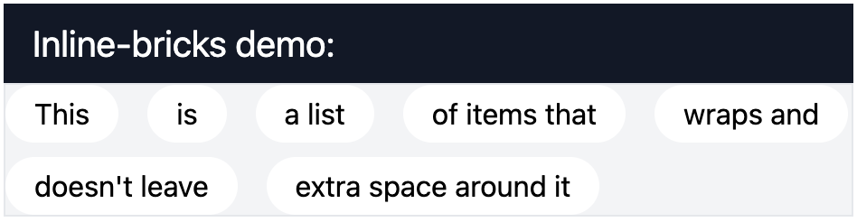

# Tailwind-inline-bricks

A Tailwind plugin for x/y-spacing a list of inline items. 

Adds negative top/left margin on a container and same but positive margin on its direct children.

```shell
npm i tailwindcss-inline-bricks
```

## Usage

```js
//tailwind.config.js

module.exports = {
  plugins: [
    // ...
    require('tailwindcss-inline-bricks')
  ]
}
```

```html
<ul class="inline-bricks-4 inline-bricks-y-2">
    <li class="inline-flex items-center rounded-full bg-white px-4 py-1">This</li>
    <li class="inline-flex items-center rounded-full bg-white px-4 py-1">is </li>
    <li class="inline-flex items-center rounded-full bg-white px-4 py-1">a list</li>
    <li class="inline-flex items-center rounded-full bg-white px-4 py-1">of items that </li>
    <li class="inline-flex items-center rounded-full bg-white px-4 py-1">wraps and</li>
    <li class="inline-flex items-center rounded-full bg-white px-4 py-1">doesn't leave</li>
    <li class="inline-flex items-center rounded-full bg-white px-4 py-1">extra space around it</li>
</ul>
```





Make sure your items are inline or inline-* or floated.

If you need a border or a top/left margin around your list, add a wrapper.


### License

MIT